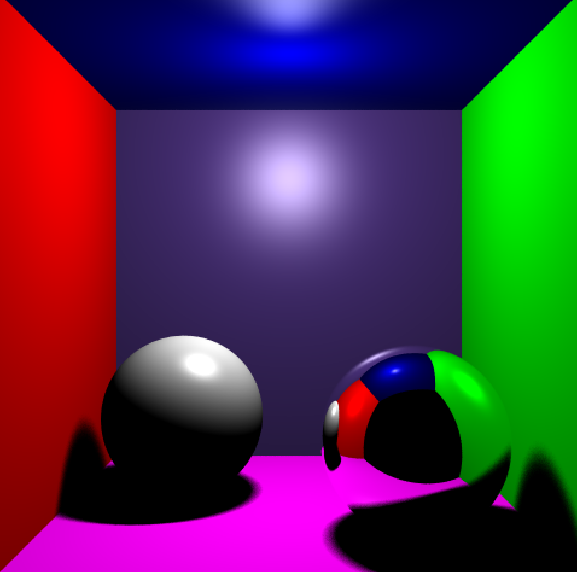
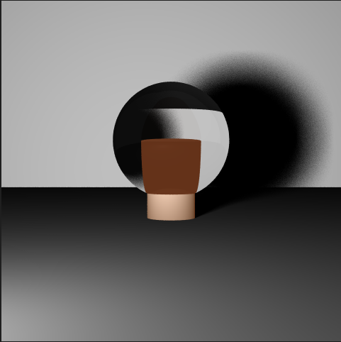
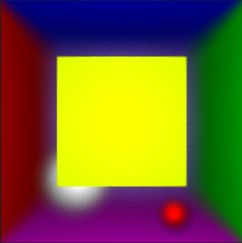

# Raytracer

Ce projet est un raytracer implémenté en C++ utilisant OpenGL et GLUT, dans le cadre d'une unité d'enseignement du master IMAGINE. Il itère sur une base de code proposée par Tamy Boubekeur ([superboubek](https://github.com/superboubek)). Il est capable de calculer des intersections avec divers objets géométriques comme des sphères, des carrés, des plans et des maillages. Le raytracer prend en charge les réflexions et la réfraction, permettant de créer des scènes avec des matériaux miroirs ou transparents. Pour plus d'informations sur le projet et son déroulement, veuillez consulter le [compte-rendu final](CRs/Raytracer_rendu_final.pdf).

<p align="center">
  
   
</p>
<p align="center">
  
  
</p>


## Dépendances

- OpenGL
- GLUT
- C++ Standard Library

## Compilation

Pour compiler ce projet, assurez-vous que les bibliothèques OpenGL et GLUT sont installées sur votre système. Ensuite, utilisez le `Makefile` fourni ou bien lancez le script `run.sh` avec la commande `bash sh run.sh` qui compilera et exécutera directement le programme.

## Exécution

Pour exécuter le raytracer, si vous ne souhaitez pas utiliser le script `run.sh`, utilisez la commande suivante dans le terminal :

```bash
./main
```

Une fois le programme lancé, appuyez sur `r` pour commencer le rendu de la scène. Une fois le rendu terminé, vous pourrez l'observer dans le fichier `rendu.ppm`.

## Fonctionnalités

Rendu de scènes 3D : calcul d'intersections précises avec des sphères, des carrés, des plans et des maillages.
- Matériaux avancés : prise en charge de matériaux miroirs et transparents pour des effets de réflexion et de réfraction réalistes.
- Contrôles interactifs : contrôles via le clavier et la souris pour manipuler la vue, activer/désactiver des modes de rendu spécifiques et ajuster les paramètres de la scène.
- Profondeur de champ : possibilité d'activer un effet de profondeur de champ pour ajouter du réalisme aux rendus.

## Commandes Clavier

- ? : Afficher l'aide.
- \+ : Changer de scène.
- r : Lancer le rendu.
- w : Basculer en affichage wireframe.
- f : Basculer en mode plein écran.
- k : Afficher les AABBs du k-d tree (uniquement pour les maillages).
- d : Activer l'effet de profondeur de champ (faire un rendu pour voir l'effet)
- Clic gauche + déplacement de la souris : Faire pivoter le modèle.
- Clic droit + déplacement de la souris : Déplacer le modèle.
- Clic molette + déplacement de la souris : Zoomer / dézoomer.
- q, Echap : Quitter l'application.