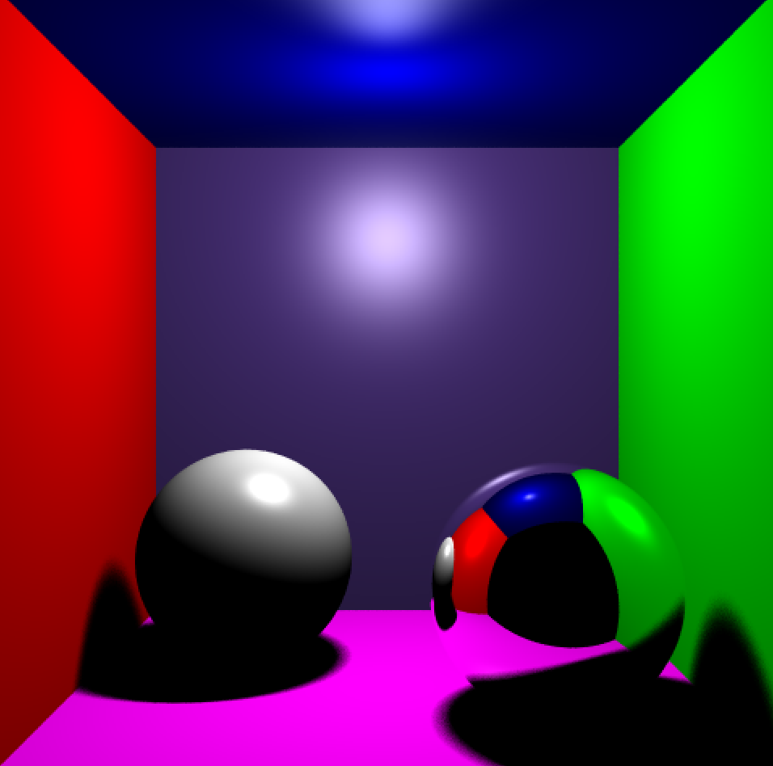
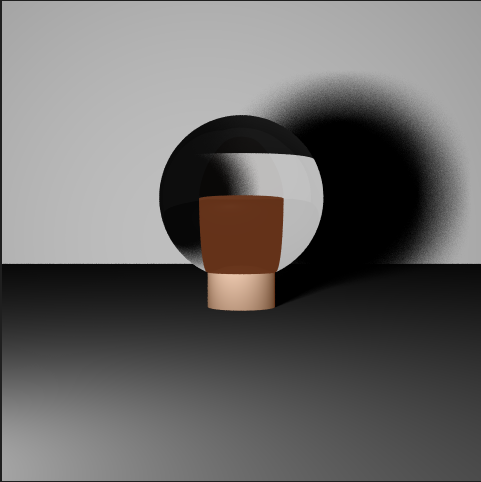
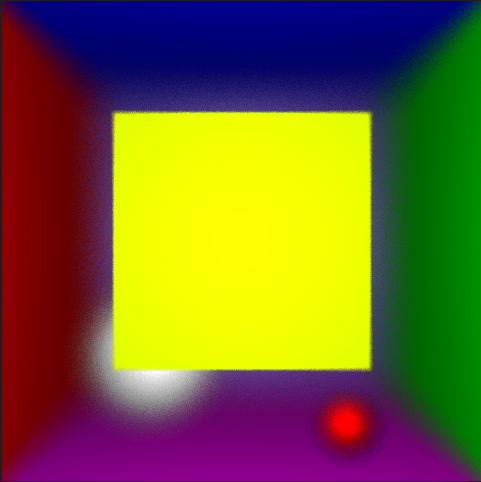

<div align="center">
   
   
   
</div>

# Raytracer

_Also available in [French](#version-française)._

This project is a raytracer implemented in C++ using OpenGL and GLUT, as part of a teaching unit for the IMAGINE Master's program. It iterates on a codebase provided by Tamy Boubekeur ([superboubek](https://github.com/superboubek)). It is capable of computing intersections with various geometric objects such as spheres, squares, planes, and meshes. The raytracer supports reflection and refraction, allowing for the creation of scenes with mirrored or transparent materials.

For more information on the project, please see the [final report (in French)](CRs/Raytracer_rendu_final.pdf).

<p align="center">
  
   
</p>
<p align="center">
  
  
</p>

## Dependencies

- OpenGL
- GLUT
- C++ Standard Library

## Compilation

To compile this project, ensure that the OpenGL and GLUT libraries are installed on your system. Then, either use the provided `Makefile` or run the `run.sh` script with the command `bash run.sh`, which will compile and execute the program directly.

## Execution

If you do not wish to use the `run.sh` script, use the following command in the terminal to run the raytracer:

```bash
./main
```
Once the program is running, press `r` to start rendering the scene. After the render is complete, you can view the output in the `rendu.ppm` file.

## Features

- **3D scene rendering:** computes precise intersections with spheres, squares, planes, and meshes.
- **Advanced materials:** supports mirror and transparent materials for realistic reflection and refraction effects.
- **Interactive controls:** keyboard and mouse controls to manipulate the view, toggle specific rendering modes, and adjust scene parameters.
- **Depth of field:** option to enable a depth of field effect to add realism to the renders.

## Keyboard controls

- `?`: Display help.
- `+`: Switch to the next scene.
- `r`: Start rendering.
- `w`: Toggle wireframe display.
- `f`: Toggle fullscreen mode.
- `k`: Display the k-d tree AABBs (for meshes only).
- `d`: Enable depth of field effect (a new render is required to see the effect).
- `Left Click + Mouse Drag`: Rotate the model.
- `Right Click + Mouse Drag`: Pan the model.
- `Scroll Wheel`: Zoom in / out.
- `q`, `Escape`: Quit the application.

## License

This project is licensed under the MIT License - see the [LICENSE](LICENSE) file for details.

---

<details>
<summary>Version française</summary>

##  Version française

Ce projet est un raytracer implémenté en C++ utilisant OpenGL et GLUT, dans le cadre d'une unité d'enseignement du master IMAGINE. Il itère sur une base de code proposée par Tamy Boubekeur ([superboubek](https://github.com/superboubek)). Il est capable de calculer des intersections avec divers objets géométriques comme des sphères, des carrés, des plans et des maillages. Le raytracer prend en charge les réflexions et la réfraction, permettant de créer des scènes avec des matériaux miroirs ou transparents. Pour plus d'informations sur le projet et son déroulement, veuillez consulter le [compte-rendu final](CRs/Raytracer_rendu_final.pdf).

<p align="center">
  
   
</p>
<p align="center">
  
  
</p>


### Dépendances

- OpenGL
- GLUT
- C++ Standard Library

### Compilation

Pour compiler ce projet, assurez-vous que les bibliothèques OpenGL et GLUT sont installées sur votre système. Ensuite, utilisez le `Makefile` fourni ou bien lancez le script `run.sh` avec la commande `bash sh run.sh` qui compilera et exécutera directement le programme.

### Exécution

Pour exécuter le raytracer, si vous ne souhaitez pas utiliser le script `run.sh`, utilisez la commande suivante dans le terminal :

```bash
./main
```

Une fois le programme lancé, appuyez sur `r` pour commencer le rendu de la scène. Une fois le rendu terminé, vous pourrez l'observer dans le fichier `rendu.ppm`.

### Fonctionnalités

- **Rendu de scènes 3D:** calcul d'intersections précises avec des sphères, des carrés, des plans et des maillages.
- **Matériaux avancés:** prise en charge de matériaux miroirs et transparents pour des effets de réflexion et de réfraction réalistes.
- **Contrôles interactifs:** contrôles via le clavier et la souris pour manipuler la vue, activer/désactiver des modes de rendu spécifiques et ajuster les paramètres de la scène.
- **Profondeur de champ:** possibilité d'activer un effet de profondeur de champ pour ajouter du réalisme aux rendus.

### Commandes clavier

- `?`: Afficher l'aide.
- `+`: Changer de scène.
- `r`: Lancer le rendu.
- `w`: Basculer en affichage wireframe.
- `f`: Basculer en mode plein écran.
- `k`: Afficher les AABBs du k-d tree (uniquement pour les maillages).
- `d`: Activer l'effet de profondeur de champ (faire un rendu pour voir l'effet)
- `Clic gauche + déplacement de la souris`: Faire pivoter le modèle.
- `Clic droit + déplacement de la souris`: Déplacer le modèle.
- `Clic molette + déplacement de la souris`: Zoomer / dézoomer.
- `q`, `Echap`: Quitter l'application.

### Licence

Ce projet est sous licence MIT - consultez le fichier [LICENSE](LICENSE) pour plus de détails.

</details>
